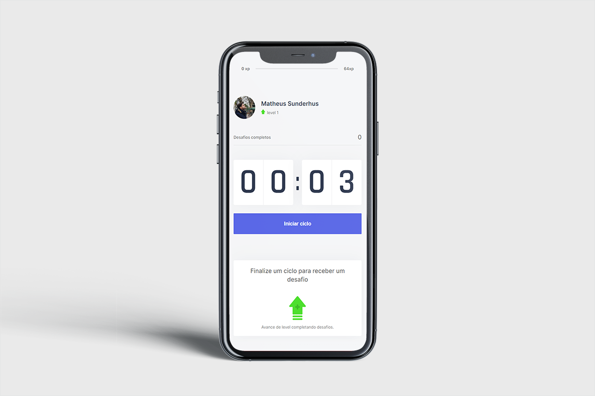

# Moveit App - React Native⚛ + Typescript


<hr>

<h1 align="center">
    Bootcamp NLW#4
  

</h1>

<p align="center">
  <a href="#-Required">Required</a>&nbsp;&nbsp;&nbsp;|&nbsp;&nbsp;&nbsp;
  <a href="#-Project">Project</a>&nbsp;&nbsp;&nbsp;|&nbsp;&nbsp;&nbsp;
  <a href="#-Layout">Layout</a>&nbsp;&nbsp;&nbsp;|&nbsp;&nbsp;&nbsp;
  <a href="#-Challenge">Challenge</a>&nbsp;&nbsp;&nbsp;|&nbsp;&nbsp;&nbsp;
  <a href="#construction_worker-Execute">Execute</a>&nbsp;&nbsp;&nbsp;|&nbsp;&nbsp;&nbsp;
  <a href="#iphone-Run">Run</a>&nbsp;&nbsp;&nbsp;|&nbsp;&nbsp;&nbsp;
  <a href="#memo-License">License</a>
</p>

<p align="center">

  
  
  
  
</p>

<br>

<p align="center">
  
</p>

## 🚀 Required
[Node](https://nodejs.org/en/download/)
[Yarn](https://yarnpkg.com/)
[Android Studio](https://developer.android.com/studio)

## 💻 Project
<p>App developed after ReactJS WEB path of NLW#4. In order to create a full functional version on mobile devices of Moveit web application.</p>

<br>
My web version of this project can be found here [Git - Moveit WEB](http://www.github.com/sunderhus/moveitnext).
<br>

If you are looking for this project download or seeing online, try this options below:<br>
[📲 Android APK download ](https://drive.google.com/drive/folders/19eCFpRdxAyv6XoEhFI5cTzI64AGTf3oT?usp=sharing)<br>

[💻 Hosted on Netlify](https://letsmoveit.netlify.app/)<br>
[💻 Hosted on Vercel](https://letsmoveitnow.vercel.app/)<br>

## 🔖 Layout

You can find the base layout here 👉 [Figma - Moveit Web](https://www.figma.com/file/nQyrP7Sl5QUZ1mlZINmjQi/Move.it-1.0-Copy).


## 🧠 How i moved this project to the next level

✅ Converted from ReactJS to ReactNative. <br>
✅ Creating workflow with Github hooks to generated a Android APK artefact.<br>
✅ Adding  ESLint, Prettier, Git commit lint.<br>
✅ Adding  styled-components and navigation.<br>
✅ Creating custom hooks that reusable on Web and Mobile.<br>
✅ Adding Async Storage instead of cookies.<br>
✅ Share the learning with others.<br>
✅ Stay sharp on both platforms.<br>

## :construction_worker: How to execute

```bash
# Clone repository
$ git clone https://github.com/sunderhus/moveitapp
```
### :iphone: Run

```bash
# clone and open on your favorite IDE, in my case Visual Studio Code.
$ cd moveitapp && code .

# install all dependencies.
$ yarn

#👽 run in Android device emulator .
$ yarn android

#🍎 run in  Ios device emulator .
$ yarn ios
```

## :memo: License

This project is under MIT License. check-out this file here 👉 [LICENSE](LICENSE.md).

---


Made by Matheus Sunderhus : [Linkedin!](https://www.linkedin.com/in/matheus-sunderhus/)


